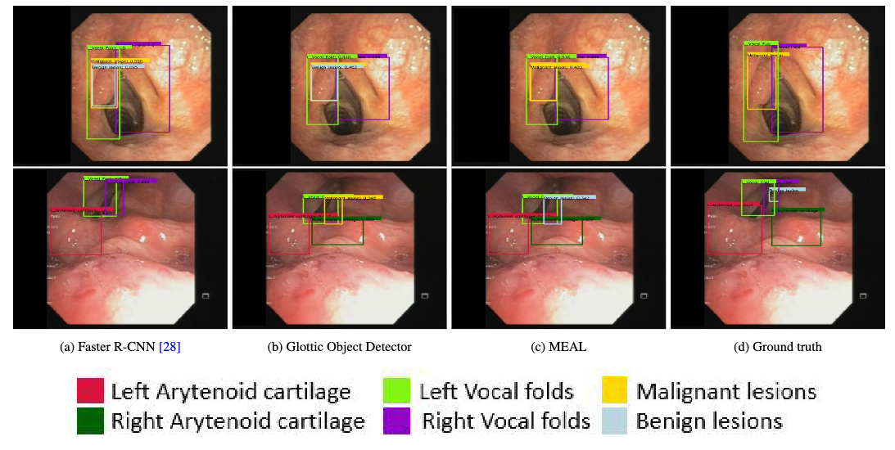

# VoFoCD


<p align="center">

</p>

We present a dataset of laryngeal images collected from 304 outpatients and inpatients at the Department of Otorhinolaryngology, Cho Ray Hospital in Ho Chi Minh City, Vietnam, between 2019 and 2021. A total of 1724 laryngeal images were acquired using a flexible endoscopic system (Olympus Medical Systems Corp., Tokyo, Japan) connected to a camera, with a resolution of 480 × 360 pixels. The research has gained approval from the ethics committee at Cho Ray Hospital in Ho Chi Minh City, Vietnam. It adheres to the ethical standards of the Declaration of Helsinki. As this is a retrospective study, the requirement to obtain informed consent from patients is waived.

This repository contains the codes for most of the experiments ran in our [upcoming paper](alt). The main contribution could be found in another repository: https://github.com/LouisDo2108/MEAL

## **Installation**

```
git clone https://github.com/kaylode/vocal-folds.git
cd vocal-folds
```

## **Reproduction**

- Build docker image from scratch or pull from dockerhub
```
DOCKER_BUILDKIT=1 docker build -t vocalfold:latest .
```
or 
```
docker pull kaylode/vocalfolds:latest
```

- Run docker image
```
docker run -it --rm --gpus '"device=0"' --name vocalfold -v $(pwd):/workspace kaylode/vocalfolds:latest
```

- After the docker started, follow instructions in the task section below to perform training / evaluation and inference

## Tasks

- [README: Vocal fold classification](./docs/classification.md)
- [README: Vocal fold detection](./docs/detection.md)


## **Acknowledgements**
- Template inheritted from https://github.com/kaylode/theseus.git
